# Theological Apologetics: The Centrality of the Resurrection

This Causal Loop Diagram (CLD) places the Resurrection of Jesus Christ at the very center of the apologetic and theological system. All other domains of apologetics (existence of God, reliability of scripture, problem of evil) are viewed through the lens of the Resurrection.

```mermaid
graph TD
    %% Central Core
    Faith(("Central Core:<br/>The Resurrection of Jesus Christ<br/>(Historical & Theological Pivot)"))

    %% Domain 1: History & The Bible
    subgraph History [Historical Reliability]
        Obj_Myth("Objections: Mythicism, Bible Corruption, Hallucination Theories")
        Doubt_Hist("Doubt about Biblical Reliability & Historical Jesus")
        Arg_Resurrection("Apologetic: Minimal Facts Argument, Bibliographical Test, Early Creeds")
        Conf_Christ("Confidence in the Bodily Resurrection")
        
        Obj_Myth -- "+ S (Triggers)" --> Doubt_Hist
        Doubt_Hist -- "+ S (Prompts)" --> Arg_Resurrection
        Arg_Resurrection -- "+ S (Builds)" --> Conf_Christ
        Conf_Christ -- "- O (Reduces)" --> Doubt_Hist
        
        %% Link to Core
        Conf_Christ == "+ S (Validates)" ==> Faith
    end

    %% Domain 2: Origins & Design (Does God Exist?)
    subgraph Origins [Theism & The Creator]
        Obj_Nat("Objections: Naturalism, Atheism, Scientism")
        Doubt_Creator("Doubt regarding a Theistic God")
        Arg_CosmoTeleo("Apologetic: Kalam Cosmological & Teleological Arguments")
        Conf_Creator("Confidence in an Uncaused, Intelligent First Cause")
        
        Obj_Nat -- "+ S (Triggers)" --> Doubt_Creator
        Doubt_Creator -- "+ S (Prompts)" --> Arg_CosmoTeleo
        Arg_CosmoTeleo -- "+ S (Builds)" --> Conf_Creator
        Conf_Creator -- "- O (Reduces)" --> Doubt_Creator
        
        %% Link to Core
        Conf_Creator -- "+ S (Makes Possible)" --> Faith
        Faith == "+ S (Proves Identity of)" ==> Conf_Creator
    end

    %% Domain 3: Purpose & Morality
    subgraph Morality [Objective Truth & Morality]
        Obj_Relativism("Objections: Moral Relativism, Nihilism")
        Doubt_Morals("Doubt regarding Objective Meaning & Right/Wrong")
        Arg_Moral("Apologetic: Moral Argument, Ontological Argument")
        Conf_Moral("Confidence in God as the Standard of Goodness")
        
        Obj_Relativism -- "+ S (Triggers)" --> Doubt_Morals
        Doubt_Morals -- "+ S (Prompts)" --> Arg_Moral
        Arg_Moral -- "+ S (Builds)" --> Conf_Moral
        Conf_Moral -- "- O (Reduces)" --> Doubt_Morals
        
        %% Link to Core
        Conf_Moral -- "+ S (Points to need for)" --> Faith
        Faith == "+ S (Demonstrates Final Victory of)" ==> Conf_Moral
    end

    %% Domain 4: The Problem of Evil
    subgraph Evil [Suffering & Evil]
        Obj_Evil("Objections: The Problem of Evil & Suffering")
        Doubt_Goodness("Doubt regarding God's Love and Power")
        Arg_Theodicy("Apologetic: Free Will Defense, Soul-Building")
        Conf_Goodness("Confidence in God's Eventual Justice")
        
        Obj_Evil -- "+ S (Triggers)" --> Doubt_Goodness
        Doubt_Goodness -- "+ S (Prompts)" --> Arg_Theodicy
        Arg_Theodicy -- "+ S (Builds)" --> Conf_Goodness
        Conf_Goodness -- "- O (Reduces)" --> Doubt_Goodness
        
        %% Link to Core
        Faith == "+ S (Answers with the Cross & Empty Tomb)" ==> Conf_Goodness
    end

    %% Protective Feedback Loop from the Core
    %% The Resurrection is the anchor that buffers believers against all other doubts
    Faith -- "- O (Buffers against)" --> Obj_Myth
    Faith -- "- O (Buffers against)" --> Obj_Nat
    Faith -- "- O (Buffers against)" --> Obj_Relativism
    Faith -- "- O (Buffers against)" --> Obj_Evil

    %% Styling Requirements
    classDef objection fill:#fce4e4,stroke:#cc0000,stroke-width:2px,color:#333,rx:5px,ry:5px;
    classDef doubtful fill:#fcf0e4,stroke:#d68a00,stroke-width:2px,color:#333,rx:5px,ry:5px;
    classDef apologetic fill:#e4eefc,stroke:#004ba0,stroke-width:2px,color:#333,rx:5px,ry:5px;
    classDef confidence fill:#e4ece4,stroke:#008000,stroke-width:2px,color:#333,rx:5px,ry:5px;
    classDef core fill:#ffe6cc,stroke:#ff8c00,stroke-width:4px,color:#333,font-weight:bold,rx:100px,ry:50px;

    class Obj_Nat,Obj_Relativism,Obj_Evil,Obj_Myth objection;
    class Doubt_Creator,Doubt_Morals,Doubt_Goodness,Doubt_Hist doubtful;
    class Arg_CosmoTeleo,Arg_Moral,Arg_Theodicy,Arg_Resurrection apologetic;
    class Conf_Creator,Conf_Moral,Conf_Goodness,Conf_Christ confidence;
    class Faith core;
```

