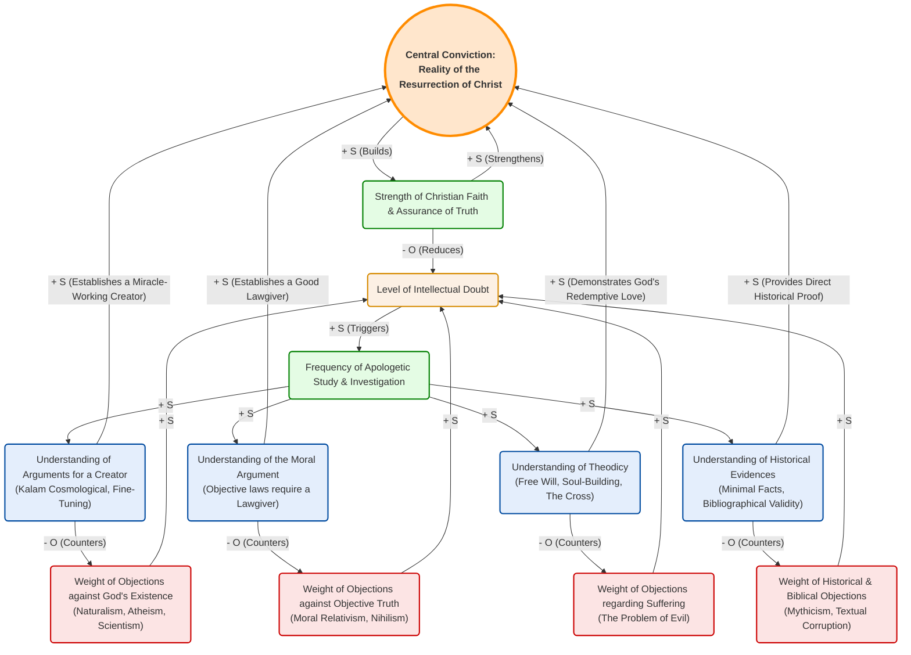

# Christian Apologetics: Causal Loop Diagram

This is a complete, fresh approach designed exactly to standard Systems-Thinking Causal Loop structural rules. 

In a causal loop, nodes are variables that increase or decrease. 
* **`+ S` (Same)** means if A goes up, B goes up. 
* **`- O` (Opposite)** means if A goes up, B goes down.

This diagram demonstrates how specific objections cause doubt, which triggers investigation into actual apologetic arguments. These arguments counter the objections, and all logically culminate in the central tenet: the Resurrection. The Resurrection then builds faith, which suppresses doubt.

### System Dynamics (How to Read This Loop):

1. **Objections create Doubt:** Skepticism regarding the existence of God, objective morality, the problem of suffering, or the historical Jesus all increase the "Level of Intellectual Doubt" (`+ S`).
2. **Doubt triggers Investigation:** In a healthy faith ecosystem, doubt acts as a catalyst, increasing the "Frequency of Apologetic Study" (`+ S`).
3. **Investigation builds Arguments:** Study increases the believer's understanding of the *actual arguments*:
   * **Cosmological/Teleological** handles atheist objections.
   * **The Moral Argument** handles relativism and nihilism.
   * **Theodicy** handles the problem of evil.
   * **Historical Evidences** handle Biblical skepticism.
4. **Arguments counter Objections:** As understanding of these apologetics goes up, the weight of the objections goes down (`- O`). This forms our primary **Balancing Loops**, stabilizing the belief system.
5. **All arguments point to the Core Tenant:** 
   * A Creator makes miracles (like a resurrection) *possible*.
   * A Lawgiver means objective truth exists and needs standardizing.
   * Theodicy asserts God cares enough to redeem suffering.
   * History proves Jesus actually rose.
   All of these uniquely synthesize into proving the **Reality of the Resurrection**.
6. **The Faith Cycle:** The Resurrection increases the **Strength of Faith**. A strong faith suppresses and mitigates Doubt (`- O`). Faith also dynamically strengthens the conviction of the Resurrection forming a **Reinforcing Loop (Virtuous Cycle)** of ever-growing confidence.
